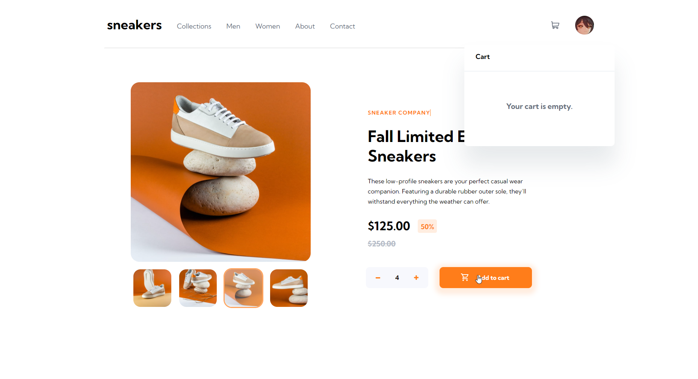
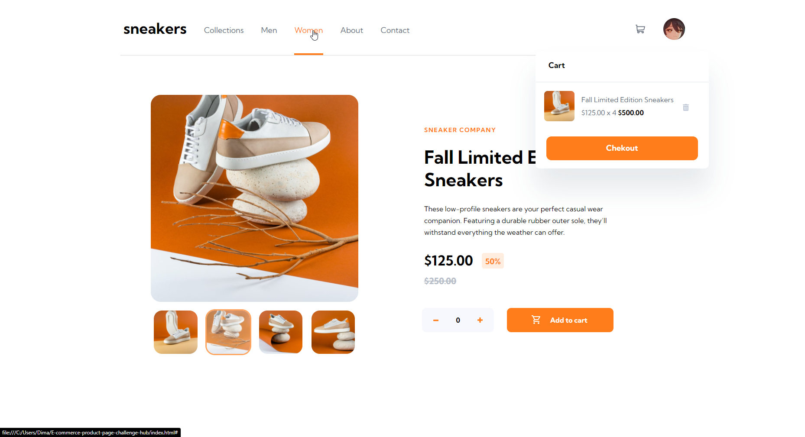
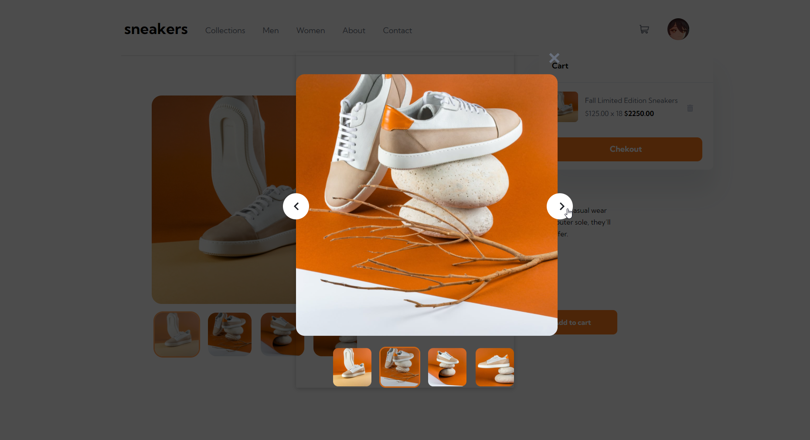

##  Ваши пользователи должны уметь: ##

- Просмотр оптимального макета сайта в зависимости от размера экрана устройства. (не получилось)
- Просматривайте состояния наведения для всех интерактивных элементов на странице (да)
- Откройте галерею лайтбоксов, нажав на большое изображение продукта. (да, но только, если на 1ю картинку (я не смог додумать))
- Переключите большое изображение продукта, нажав на маленькие миниатюры (да)
- Добавить товары в корзину (да)
- Просматривайте корзину и удаляйте из нее товары (да)

#  Процесс #  
- Html (div'ы)
- Css (flexbox'ы/grid'ы)
- JavaScript без библиотек (с одной микро-библиотекой "closest")  
*** 

##  Результат ## 
Для меня это было интересное задание, хоть я и сделал (как по мне) криво, но я узнал довольно много нового

***
Возможно, скрипт для слайдера можно написать короче и красивее...

##  Ссылки, которые мне помогли ## 

- [Js](https://medium.com/@dan.postnov/%D0%BC%D0%BE%D0%B4%D0%B0%D0%BB%D1%8C%D0%BD%D1%8B%D0%B5-%D0%BE%D0%BA%D0%BD%D0%B0-%D0%BD%D0%B0-javascript-30-%D1%81%D1%82%D1%80%D0%BE%D0%BA-%D0%BA%D0%BE%D0%B4%D0%B0-dbbb599649f3 "модальное окно")
- [Js](https://developer.mozilla.org/ru/docs/Web/API/Element/classList)
- [Css](https://html5book.ru/css-grid/)